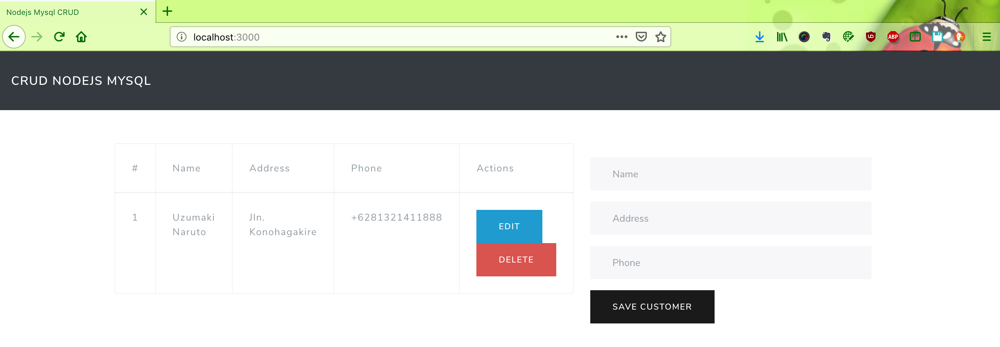
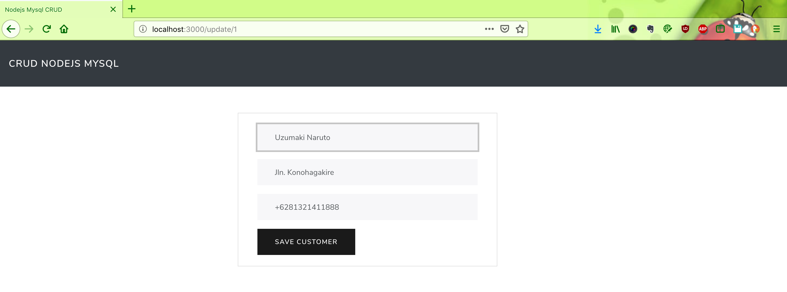

# nodejs-mysql-crud

Run this project by this command :

1. `npm install`
2. `npm start`
3. `localhost:3000`

To test:

`npm test`

### Pre-requisites:
- Start a mysql database
- Execute `database/db.sql` script in msyql server to create database, table and user
- If running in localhost, configure `/etc/hosts` to point *paystand-mysql* to localhost

#### Screen shot

Home Page

Add New Customer

